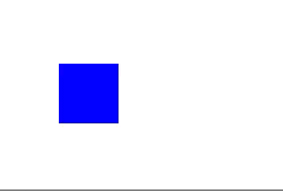
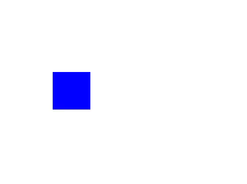
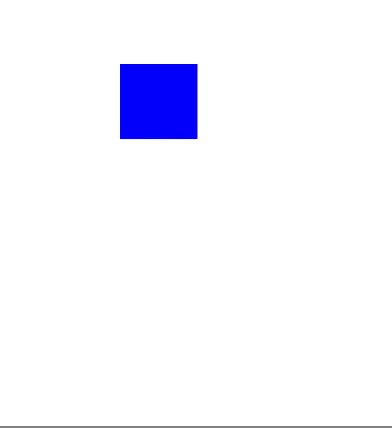

# CHXChainAnimation

### Screenshot

​	[CHXChainAnimation](https://github.com/chinsyo/CHXChainAnimation/) is a light weight yet powerful chainable animation library, it's the easiest way to write **iOS animation**.

```objective-c
self.myView.moveX(50).spring.thenAfter(1.0).makeBackground([UIColor purpleColor]).easeIn.animate(0.5);
```

|      Effect      |                Screenshot                |
| :--------------: | :--------------------------------------: |
|      Rotate      |  |
|      CGSize      |  |
| Background Color |  |


## What's wrong with animations?

CAAnimations and UIView animations are extremely powerful, but it is difficult to chain multiple animations together, especially while changing anchor points. 

Furthermore, complicated animations are difficult to read. 

Say I want to move myView 50 pixels to the right with spring and then change the background color with inward easing when the movement has finished:

### The Old Way

```objective-c
    [UIView animateWithDuration:1.0
                          delay:0.0
         usingSpringWithDamping:0.8
          initialSpringVelocity:1.0
                        options:0 animations:^{
                            CGPoint newPosition = self.myView.frame.origin;
                            newPosition.x += 50;
                            self.myView.frame.origin = newPosition;
    } completion:^(BOOL finished) {
        [UIView animateWithDuration:0.5
                              delay:0.0
                            options:UIViewAnimationOptionCurveEaseIn
                         animations:^{
            self.myView.backgroundColor = [UIColor purpleColor];
        } completion:nil];
    }];
```

Thats pretty gross huh... With CHXChainAnimation it is one line of code. 

### The New Way 

```objective-c
self.myView.moveX(50).spring.thenAfter(1.0).makeBackground([UIColor purpleColor]).easeIn.animate(0.5);
```
## Installation
Either clone the repo and manually add the Files in [CHXChainAnimation](./CHXChainAnimation) or add the following to your podfile(**Recommend**).

```
pod 'CHXChainAnimation', '~> 1.0.0'
```
Then just import the following header.

```objective-c
#import "CHXChainAnimation.h"
```

This is all a UIView category, so these chainables can be used on any UIView in a file where the header is imported.

###Animating
Chainable properties like **moveX(x)** must come between the view and the **animate(t)** function

Below is an example of how to double an objects size over the course of one second. 

```objective-c
view.makeScale(2.0).animate(1.0);
```

If you want to move the view while you scale it, add another chainable property. Order is not important

```objective-c
view.makeScale(2.0).moveXY(100, 50).animate(1.0);
// the same as view.moveXY(100, 50).makeScale(2.0).animate(1.0);
```

A full list of chainable properties can be found [here](#chainables)

### Chaining Animations

To chain animations seperate the chains with the **thenAfter(t)** function.

Below is an example of how to scale and object for 0.5 seconds, and then move it for 1 second when that is done.

```objective-c
view.makeScale(2.0).thenAfter(0.5).moveXY(100, 50).animate(1.0);
```
### Animation Effects

To add an animation effect, call the effect method after the chainable property you want it to apply to.

Below is an example of scaling a view with a spring effect.

```objective-c
view.makeScale(2.0).spring.animate(1.0);
```

If you add 2 to the same chainable property the second will cancel the first out. 

```objective-c
view.makeScale(2.0).bounce.spring.animate(1.0);
// The same as view.makeScale(2.0).spring.animate(1.0);
```

A full list of animation effect properties can be found [here](#effects)

### Anchor
To anchor your view call an achoring method at some point in an animation chain. Like effects, calling one after another in the same chain will cancel the first out. 

Below is an example of rotating a view around different anchor points

```objective-c
view.rotate(180).anchorTopLeft.thenAfter(1.0).rotate(90).anchorCenter.animate(1.0);
// view.rotate(90).anchorTopLeft.anchorCenter == view.rotate(90).anchorCenter
```

A full list of anchor properties can be found [here](#anchors)

###Delays
To delay an animation call the **wait(t)** or **delay(t)** chainable property.

Below is an example of moving a view after a delay of 0.5 seconds

```objective-c
view.moveXY(100, 50).wait(0.5).animate(1.0);
// The same as view.moveXY(100, 50).delay(0.5).animate(1.0);
```
###Completion
To run code after an animation finishes set the **animationCompletion** property of your UIView or call the **animateWithCompletion(t, completion)** function.

```objective-c
view.makeX(0).animateWithCompletion(1.0, CHXAnimationCompletion(){
	NSLog(@"Animation Done");
});
```

Is the same as: 

```objective-c
view.animationCompletion = CHXAnimationCompletion(){
	NSLog(@"Animation Done");
};
view.makeX(0).animate(1.0);
```

Is the same as:

```objective-c
view.makeX(0).animate(1.0).animationCompletion = CHXAnimationCompletion(){
	NSLog(@"Animation Done");
};
```

### Bezier Path
You can also animate a view along a [UIBezierPath](https://developer.apple.com/library/ios/documentation/2DDrawing/Conceptual/DrawingPrintingiOS/BezierPaths/BezierPaths.html). To get a bezier path starting from the views position, call the **bezierPathForAnimation** method. Then add points or curves or lines to it and use it in a chainable property.

```objective-c
UIBezierPath *path = [view bezierPathForAnimation];
[path addLineToPoint:CGPointMake(25, 400)];
[path addLineToPoint:CGPointMake(300, 500)];
view.moveOnPath(path).animate(1.0);
```
Animation effects do not work on path movements.

### Semantic
I included a chainable property called **seconds** that is there purely for show. It does however, make the code a little more readable (if you're into that sort of thing).

```objective-c
view.makeScale(2.0).thenAfter(0.5).seconds.moveX(20).animate(1.0);
// view.makeScale(2.0).thenAfter(0.5).moveX(20).animate(1.0);
```

### Transform

Use the **transform** chainable properties. These are better for views constrained with Autolayout. You should not mix these with other chainable properties 

```objective-c
viewWithConstraints.transformX(50).transformScale(2).animate(1.0);
```

### Animating Constraint

Typically frames and autolayout stuff shouldn't mix so use the **makeConstraint** and **moveConstraint** chainable properties with caution (i.e dont try and scale a view when it has a height and width constraint). **These properties should only be used with color, opacity, and corner radius chainable properties** because they dont affect the layers position and therfore won't affect constraints. 

This was only added as a syntactically easy way to animate constraints. The code below will set the constant of **topConstraint** to 50 and then trigger an animated layout pass in the background. 

```objective-c
// You have a reference to some constraint for myView
self.topConstraint = [NSLayoutConstraint ...];
...
self.myView.makeConstraint(self.topConstraint, 50).animate(1.0);
```
This does not support animation effects yet. 

## Contact Info && Contributing

Feel free to email me at [chinsyo@sina.cn](mailto:chinsyo@sina.cn?subject=CHXChainAnimation). I'd love to hear your thoughts on this, or see examples where this has been used.

[MIT License](./LICENSE)
